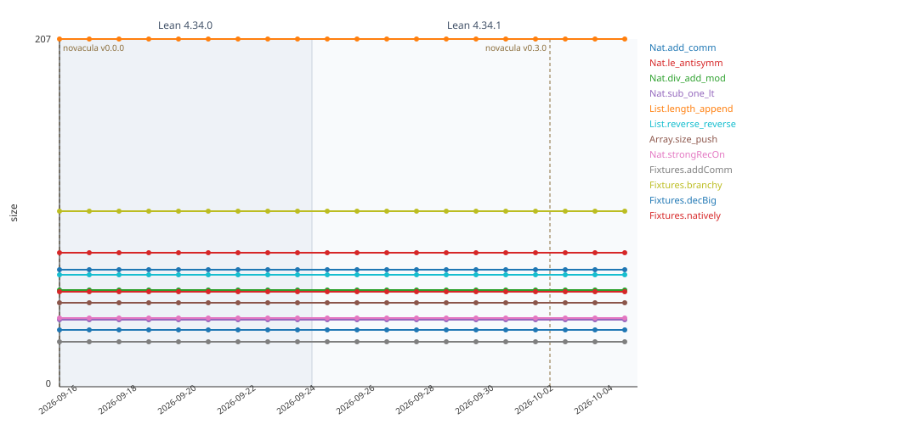

# novacula-history

Daily metric history of [Novacula](https://github.com/RianKoja/novacula), kept apart from its
code so the daily runs do not add commits there.

Every day, [`track.yml`](.github/workflows/track.yml) checks out the latest Novacula release,
builds it on the latest stable Lean, runs `make track` on Novacula's `targets.txt`, and commits
`history.csv` and `history.svg` here.

Shaded bands mark Lean versions and dashed lines mark Novacula minor versions: scores are
comparable only within one version of each. Rows written before Novacula had releases are labeled
`v0.0.0`.
